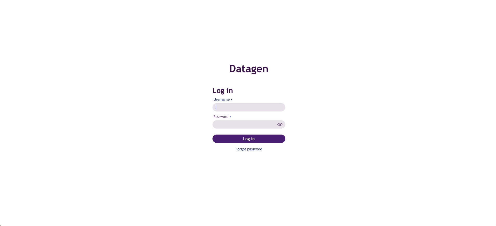

= Datagen - Data Generation

Goal of this project is to generate meaningful Data into various Big Data Services and File systems.

Built originally for Cloudera Data Platform, it works with S3, ADLS, GCS, local file systems, and open-source services (such as kafka, hive etc...).

== What is it ?

Datagen is a Web Server with a UI and a sets of APIs (with a swagger) to interact with.

Datagen is able to:

- Push Data to multiple systems (HDFS, S3, ADLS, GCS, Kafka, Hive, HBase etc...)
- Handle multiple formats (Avro, Parquet, ORC, JSON, CSV)
- Generate structured data of different types (string, integer, timestamp, uuid etc...)
- Provide pre-defined data filterable (countries, 40K+ cities, 35K+ names, phone pattern etc... )
- Make data respecting rules (min, max, repartition, pattern, regex etc...)
- Add relations between data generated (one column value depends on other's values with possible complex evaluation)
- Generate unstructured data leveraging AI (OpenAI, Bedrock, Ollama, and even any model locally embedded)
- Schedule generation of data
- Analyze existing data to mimic it (currently in alpha version)

== Public Documentation

Refer to this documentation to understand Datagen, know how to deploy and use it:

link:https://datagener.github.io/[https://datagener.github.io/]

== Dependencies

Datagen is made with:

- Java 17
- Maven 3.9

It is built for:

- CDP 7.1.9+
- AWS, GCP, Azure
- Docker & K8s

Datagen is made as a Spring Boot project with dependencies on SDK to interact with various services.

== Deployment

Datagen can be run in two ways:

- As a standalone web server, anywhere, but you'll need to provide configurations manually
- Fully integrated into CDP using a parcel, a CSD and available as service through Cloudera Manager (configuration is automatic)

=== Standalone Web Server

To make a fast and easy deployment, here is a procedure:

        wget https://datagen-repo.s3.eu-west-3.amazonaws.com/1.0.0/standalone/datagen-standalone-files.tar.gz

        tar -xvzf datagen-standalone-files.tar.gz
        cd datagen_standalone-1.0.0/

        ./launch.sh

By default, TLS is de-activated and a user/password is required (**admin/admin** by default).

=== On CDP

Refer to this detailed procedure available on link:https://datagener.github.io/datagen/1-installation/2-CDP/1-installation-csd-parcel.html[Datagen's Documentation]

By default, TLS is activated and a user/password is required (**admin/admin** by default).

