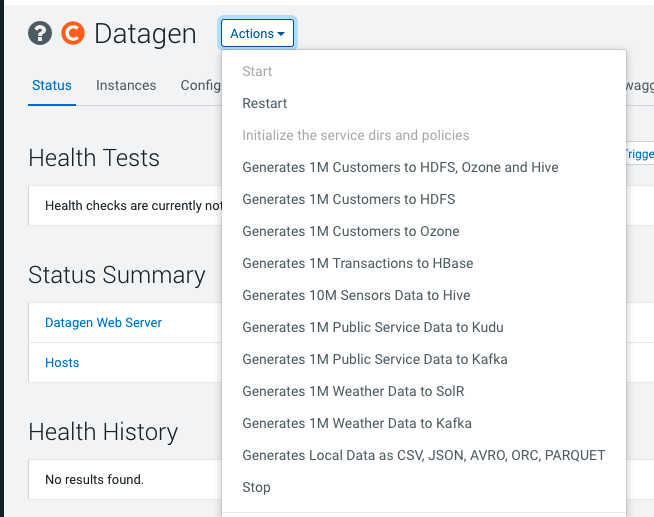

= Datagen - Data Generation

Goal of this project is to generate Data into various services of CDP platform.

== Dependencies

Datagen is made with:

- Java 11
- Maven 2.5

It is built for:

- CDP 7.1.7

Datagen is made as a Spring Boot project with dependencies on various services of the CDP platform.

== How does it work ?

Datagen is launching a Web Server with a sets of API to interact with.
It comes also with a handy swagger to easily interact with APIs.

These APIS lets you:

- Ask for Data Generation to specified services
- Schedule Data Generation to specified services
- Test Data Generation
- Get Metrics and health status of the web server

Parameters have all default values and can be empty (they will be defaulted), but they all also can be overriden,
letting clients customize fully the data generation.

By default, TLS is activated and a user/password is required (admin/admin by default).

== Deployment

Datagen can be run in two ways:

- As a standalone web server, anywhere, but you'll need to provide configurations manually
- Fully integrated into CDP using a parcel, a CSD and available as service through Cloudera Manager (configuration is automatic)

=== How to run it locally ?

First, go to link:pom.xml[pom.xml] and change cdp version to yours, change also if required, individual versions of each component. +
Then Package the program:

        mvn clean package

[source,bash]
java -Dnashorn.args=--no-deprecation-warning --add-opens java.base/jdk.internal.ref=ALL-UNNAMED -jar random-datagen.jar

=== How to deploy it on CDP ?

This project aims to be bundled as a CSD and a Parcel, so it can be managed easily Cloudera Manager.

Repository containing all Datagen Versions of CSD and parcels: link:https://datagen-repo.s3.eu-west-3.amazonaws.com/index.html[https://datagen-repo.s3.eu-west-3.amazonaws.com/index.html]

Steps to install it and configure it can be found here: link:https://frischhwc.github.io/datagen/installation/1-installation-csd-parcel.html[https://frischhwc.github.io/datagen/installation/1-installation-csd-parcel.html]
or here: link:https://community.cloudera.com/t5/Community-Articles/Datagen-Data-Generator-tool-built-for-CDP/ta-p/357561[https://community.cloudera.com/t5/Community-Articles/Datagen-Data-Generator-tool-built-for-CDP/ta-p/357561]

To build & Deploy from scratch the project and deploy it to a cluster (especially useful for testing development), refer to following documentation
link:dev-support/deployment/README.adoc[dev-support/deployment/README.adoc]

Deploying it to CDP enables auto-configuration from Cloudera Manager, hence datagen is already configured to interact with services from CDP.
It also ensures that rights are well set and default directories are created.

Moreover, the full datagen service can be managed through Cloudera Manager (start/stop/configuration).

It also provides already set up commands directly available from Cloudera Manager, under Datagen > Actions:

=== NOT RECOMMENDED: How to run it on a cluster in a non-integrated way ?

Use script link:src/main/resources/scripts/launchToPlatform.sh[src/main/resources/launchToPlatform.sh] by setting your hostname, ssh user and key

It will create a directory on the platform and send all needed files there. +
Then script link:src/main/resources/scripts/launch.sh[src/main/resources/scripts/launch.sh] will be launched on platform.

This script add required jars to classpath and launch jar.

== Data

=== Where data will be generated ?

There are various possible services where data can be generated, these are called sinks and here is the full possible list:

- HDFS-AVRO : generates an AVRO file sent to HDFS
- HDFS-CSV : generates a CSV file sent to HDFS
- HDFS-JSON : generates a JSON file sent to HDFS
- HDFS-ORC : generates an ORC file sent to HDFS
- HDFS-PARQUET : generates a PARQUET file sent to HDFS
- HBASE
- KAFKA : Generates an avro or json or csv message and send it to Kafka
- KUDU
- OZONE-AVRO : generates an AVRO file sent to OZONE
- OZONE-JSON : generates a JSON file sent to OZONE
- OZONE-CSV : generates a CSV file sent to OZONE
- OZONE-ORC : generates an ORC file sent to OZONE
- OZONE-PARQUET : generates a PARQUET file sent to OZONE
- SOLR
- HIVE : generate tables (External or Managed or Iceberg)
- PARQUET: Generates a parquet file locally
- ORC: Generates an ORC file locally
- CSV: Generate a CSV file locally
- AVRO: Generates an Avro file locally
- JSON: Generates a JSON file locally

__N.B: It is possible to output same data into various sinks__

=== Data generated

Data is generated according to a model passed in first argument of the launch.

Exmaples of models could be found under link:src/main/resources/models/[src/main/resources/models/]

This model is divided into 4 sections:

==== Fields:

This is an array describing all fields by at least a name and a type, length could be precised but is optional. +
All available types are:

- STRING  is an alphaNumeric string (length represents length of string, by default 20 if not set) +
- STRINGAZ  is an alpha non-numeric string (length represents length of string, by default 20 if not set) +
- INTEGER (with length representing maximum value, by default Integer.MAX_VALUE) +
- INCREMENT INTEGER An integer increment for each row +
- INCREMENT LONG A long incremented for each row +
- BOOLEAN +
- FLOAT +
- LONG +
- TIMESTAMP (is timestamp of data generation) +
- BYTES (length represents length of byte array, by default 20) +
- HASHMD5   is the hash of a random string (length represents size of byte array, by default 32) +
- BLOB   is a byte array of default 1MB (length represents length of byte array) (Use it carefully) +
- BIRTHDATE  is a date between 1910 & 2020 (but you can set your own limits) +
- NAME  is a first name taken from a dictionary of over 20,000+ names (can be filtered by country) +
- COUNTRY   is a country name taken from a dictionary +
- PHONE NUMBER A 10 digits with international indicator in front (can be filtered by country) +
- EMAIL   is string as in form of (<name>.<name>|<AZ09><name>)@(gaagle.com|yahaa.com|uutlook.com|email.fr) +
- IP   is a string representing an IP in form of Ipv4: 0-255.0-255.0-255.0-255 +
- UUID is an unique universal identifier: xxxx-xxxx-xxxx-xxxx +
- CITY  is an object representing an existing city (name, lat, long, country) made from a dictionary of over 10,000+ cities, only the name is taken for this field (can be filtered by country) +
- CSV   is an object taken from a given CSV file +
- LINK  is a string whose values is derived from another field, currently from a CITY or CSV field +

Fields values could be also more "deterministic" by providing manually values, or providing values and give them a weight to choose repartition,
or even create conditions based on other columns values.

===== Possible values

Each field could have defined a set of "possible_values" that will limit values to be exactly these.

===== Possible values weighted

A weight could also be defined to make it less random and make each value having a percentage of appearance. (Only String, Boolean, Integer and Long supports weight).
Sum of weights is made internally and probability of appearance of a value will be its weight divided by sum of weights.

===== Minimum & Maximum

It is possible for INTEGER and LONG type to define a minimum and a maximum.

===== Conditionals

Conditions must be make on previous defined columns.
Two types of condition:

1. Formula, possible for Float/Integer/Long
Types must be compatible (int can be converted to long but not the invert).
It is a simple expression evaluated with operators: * , + , - , /
Output column must be of type STRING, Input columns (used to compute) must be INTEGER or LONG or FLOAT

Example:

[source,json]
        "conditionals": {
            "always": "2 * $very_low_int + 56 - $low_int"
        }

Be careful of letting space in your expression to be parsable and evaluated.

1. Value depend on other column's value, possible for Integer/Long/Float/String/Boolean (using these types)
Support for && (= AND) and || (= OR).
Conditions must be equals (=) or unequals (!=) or superior (>) or inferior (<).
Multiple conditions is working on same line.
Conditions are evaluated one by one like a "if ... else if ...", first one returning true is picked.
Output column must be of type STRING, columns of input must be STRING or LONG or INTEGER or FLOAT

Example:

[source,json]
        "conditionals": {
            "$country_of_provenance=FRANCE" : "Paris",
            "$country_of_provenance=GERMANY | $increment_int<40" : "Berlin",
            "$country_of_provenance=GERMANY & $increment_int>40" : "Berlin_40"
        }

_N.B.: Multiple conditions are evaluated using precedence of AND over OR, meaning: A & B | C will in fact be evaluated like (A & B) | C_

===== Special Case : Cities (CITY & LINK)

It is possible to define CITY for a field as its type, this is what happens under the hood:

- A dictionary of 41,000 cities all around the world is loaded into memory
- A filter could be applied to take only some cities from one or multiple countries
- When a row is required, a small city object is constructed, taken randomly from in-memory loaded data, it consists of name, lattitude, longitude and country

It is possible to define a filter based on country for this field, by adding ``"filters": ["France", "Spain"]`` in the definition of the field. +
With this, only cities whose country is France or Spain will be loaded.

The field CITY will ONLY have the city name written as a value for the row.

It is possible to define LINK for a field as its type, it will be "linked" to a CITY field by defining conditionals on it.

This field will be a string type and will have its value taken from the previous city object created, by either being latitude, longitude or country.

The relationship between this field and the CITY field is defined like this:

[source,json]
    "conditionals": {
        "link": "$city.country"
    }

where city here is the name of another field whose type is CITY.

===== Special Case : Csv file (CSV & LINK)

It is possible to take data from a CSV file with a header, ";" as a separator and a line separator between each line.
File path must be specified using: ``"file": "/home/my_csv.csv"``

This file is loaded into memory and filtered (if some filters are specified like this ``"filters": ["country=France"]``).

All fields from teh CSV will be treated as STRING types and a field name must be specified (like this ``"field": "name"`` ) to know which one should be set for this field.

Then, a LINK can be made from other fields to this one and hence get linked values.

===== Examples

A simple definition of a field looks like this:

[source,json]
    {
      "name": "name",
      "type": "NAME"
    }

A definition with restricted values:

[source,json]
    {
      "name": "credits_used",
      "type": "INTEGER",
      "possible_values": [0, 1, -1]
    }

A definition with weighted values to not generate even spread data:

[source,json]
    {
      "name": "country_of_provenance",
      "type": "STRING",
      "possible_values_weighted": {
        "France": 40,
        "Germany": 60
      }
    }

A definition with minimum and maximum:

[source,json]
    {
      "name": "percentage",
      "type": "INTEGER",
      "min": 0,
      "max": 100
    }

A definition with a formula to evaluate value of the column:

[source,json]
    {
      "name": "percentage",
      "type": "INTEGER",
      "conditionals": {
            "always": "2 * $very_low_int + 56 - $low_int"
        }
    }

A definition with some conditions (equalities and inequalities) to evaluate its value:

[source,json]
    {
      "name": "percentage",
      "type": "INTEGER",
      "conditionals": {
            "$country_of_provenance=FRANCE" : "Paris",
            "$country_of_provenance=GERMANY | $increment_int<40" : "Berlin",
            "$country_of_provenance=GERMANY & $increment_int>40" : "Berlin_40"
        }
    }

A definition with one field which represent a CITY (filtered on either France or Spain) and other fields for its longitude, latitude and country:

[source,json]
    {
      "name": "city",
      "type": "CITY",
      "possible_values": ["France", "Spain"]
    },
    {
      "name": "city_lat",
      "type": "LINK",
      "conditionals": {
        "link": "$city.lat"
      }
    },
    {
      "name": "city_long",
      "type": "LINK",
      "conditionals": {
        "link": "$city.long"
      }
    },
    {
      "name": "city_country",
      "type": "LINK",
      "conditionals": {
        "link": "$city.country"
      }
    }

A definition with two fields taken from a given CSV file, this file is filtered on a column, and another field is taken as a linked to the first one:

[source,json]
    {
      "name": "person",
      "type": "CSV",
      "filters": ["country=France"],
      "file": "/root/dictionnaries/person_test.csv",
      "field": "name"
    },
    {
      "name": "person_department",
      "type": "LINK",
      "conditionals": {
        "link": "$person.department"
      }
    }

The CSV file looks like this:

[source,csv]
name;department;country
francois;PS;France
kamel;SE;France
thomas;RH;Germany
sebastian;PS;Spain

==== Table Names:

An array of following properties self-describing: +

- HDFS_FILE_PATH +
- HDFS_FILE_NAME +
- HBASE_TABLE_NAME +
- HBASE_NAMESPACE +
- KAFKA_TOPIC +
- OZONE_VOLUME +
- OZONE_BUCKET +
- OZONE_KEY_NAME +
- OZONE_LOCAL_FILE_PATH +
- SOLR_COLLECTION +
- HIVE_DATABASE +
- HIVE_HDFS_FILE_PATH +
- HIVE_TABLE_NAME +
- HIVE_TEMPORARY_TABLE_NAME +
- KUDU_TABLE_NAME +
- LOCAL_FILE_PATH +
- LOCAL_FILE_NAME +
- AVRO_NAME +

==== Primary Keys:

An array of following properties, each of it associated with a value that is
corresponding to the name of field (multiple fields could be provided separated by a comma): +

- KAFKA_MSG_KEY +
- HBASE_PRIMARY_KEY +
- KUDU_PRIMARY_KEYS +
- KUDU_HASH_KEYS +
- KUDU_RANGE_KEYS

==== Options:

An array of other options to configure basic settings for some sinks: +

- HBASE_COLUMN_FAMILIES_MAPPING +
This mapping must be in the form : "CF:col1,col2;CF2:col5" +
- SOLR_SHARDS +
- SOLR_REPLICAS +
- KUDU_REPLICAS +
- ONE_FILE_PER_ITERATION +
- KAFKA_MESSAGE_TYPE +
- KAFKA_JAAS_FILE_PATH +
- SOLR_JAAS_FILE_PATH +
- HIVE_THREAD_NUMBER +
- HIVE_ON_HDFS +
- HIVE_TABLE_TYPE +
- HIVE_TEZ_QUEUE_NAME +
- HIVE_TABLE_PARTITIONS_COLS +
This is a just one string with a comma separated list of cols: "col1,col2" +
- HIVE_TABLE_BUCKETS_COLS +
This is a just one string with a comma separated list of cols: "col1,col2" +
- HIVE_TABLE_BUCKETS_NUMBER +
- CSV_HEADER +
- DELETE_PREVIOUS +
- PARQUET_PAGE_SIZE +
- PARQUET_ROW_GROUP_SIZE +
- PARQUET_DICTIONARY_PAGE_SIZE +
- PARQUET_DICTIONARY_ENCODING +
- KAFKA_ACKS_CONFIG +
- KAFKA_RETRIES_CONFIG +
- KUDU_BUCKETS +
- KUDU_BUFFER +
- KUDU_FLUSH +
- OZONE_REPLICATION_FACTOR +
- HDFS_REPLICATION_FACTOR +

Note that all not required settings could be safely removed with no errors.

== Parallel Launch

Note that to make it more efficient and faster, this program can be launched in parallel, and especially on yarn thanks to this project: link:yarn-submit[https://github.infra.cloudera.com/frisch/yarnsubmit]. +
This project has intent to launch java programs on YARN containers, with as many instances as desired by the user, which is perfectly suited for this project. +

The command used to launch the application with yarn-submit project was the following:

[source,bash]
        ./yarn-submit.sh
                --app-name=random
                --container-number=10
                --kerberos-user=frisch/admin@FRISCH.COM
                --keytab=/home/frisch/frisch.keytab
                --app-files=/home/frisch/random-datagen/model.json,/home/frisch/random-datagen/config.properties,/home/frisch/random-datagen/log4j.properties
                /home/frisch/random-datagen/random-datagen.jar model.json 1000 100 hbase

== Code Architecture

=== How does it work ?

This is a Spring Boot server, that will listen to requests to generate data.

API Call to the DataGenerationController will lead to a call to CommandRunnerService that will create an object Command.
This object contains all properties required to run a data generation: Basic properties like number of batches, threads, rows etc...
Properties regarding the sink: sink, database name, paths, truststore etc...
And the model file parsed and set as an object.

This command is queued to be launched and an UUID is returned by the controller. (This ID can be used to track progress of the command)

Generation are made one after another one by the processCommands() scheduled function running every seconds to un-queue a command and run it.
It contains the logic of setting up batches, creates threads and send rows to desired sinks.

When a command is scheduled, it is simply added to a List of scheduled commands, which are then periodically checked and added to the queue
list of processing if needed.

Other controllers allows to check status of the server, get metrics, check status of commands, get all commands, remove schedule commands.
There is also a controller to just run a test on a model, returning a row as a JSON directly.

=== How to add a sink ?

- Create a Sink under sink package that extends SinkInterface 
- Implements required functions (to send one and multiple rows to the output system) and all other
needed function in this class
- Add the sink in the function "stringToSink" of SinkParser under config package
- Add the sink initialization under the function "sinksInit" of SinkSender under sink package
- Add a function to create required object for insertion under Field abstract class
- If needed, add a specific function for some or all Fields extended class
- Add a function to create required object combining all Fields functions under Row class
- If needed, under Model class, create a function to create initial queries required
- Add required properties under config.properties file

=== How to add a type of field ?

- Create an extended class of field under package model.type
- Create a builder in previous class, implement generateRandomValue() function
- If needed, override Fields function specific to some or all sinks available
- In Field, instantiateField() function, add in the switch case statement, the new type of field
- In Model, modify functions on table creation to be able to integrate the new type of field

== TODOs

TODO: Add some tests +
TODO: Add review of model before launching (implements some checks in it)

